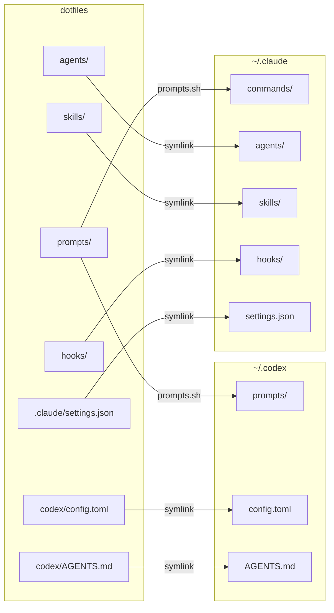

# dotfiles

Personal macOS development environment configuration.

## Getting Started

```shell
# Initial setup (Homebrew, Rust toolchain, GitHub auth)
./bootstrap.sh

# Sync prompts to ~/.codex and ~/.claude
./prompts.sh

# Install GitHub CLI extensions
./gh/gh-bundle.sh
```

## Repository Structure

```
.config/          XDG configs (nvim, zsh, git, alacritty, ghostty, etc.)
.claude/          Claude AI configuration
.hammerspoon/     macOS automation
agents/           Agent definitions
skills/           Claude skills
prompts/          Prompt templates
gh/               GitHub CLI extensions
hooks/            Dev workflow hooks
docs/             Documentation
```

The `u_agents` runner is maintained in https://github.com/uuta/uuter.

## Managed Tools

**Shell**: Zsh + Znap + Powerlevel10k

**Editor**: Neovim with LSP

**Terminals**: Alacritty, Ghostty, WezTerm

**VCS**: Git, Jujutsu, GitHub CLI

**Languages**: Node.js (nvm), Python (pyenv), Go, PHP

**Dev Tools**: Docker, Terraform, pre-commit

## AI Tools Configuration

Shared configuration for Codex and Claude Code:



- `./prompts.sh` symlinks prompts to both `~/.codex` and `~/.claude/commands`
- `codex/config.toml` is the dotfiles-owned Codex user configuration
- `codex/AGENTS.md` is the dotfiles-owned global Codex guidance entrypoint
- `.zshrc` ensures the managed symlinks exist for shared config and agent tooling
